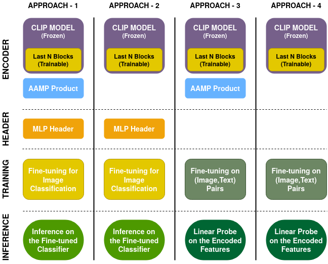
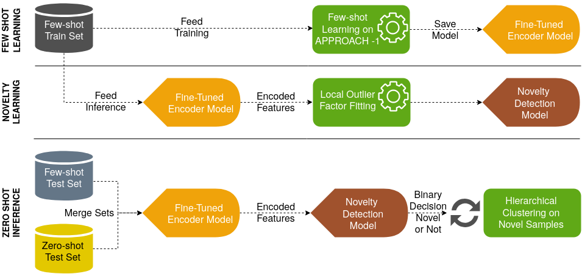

# CLIP

[[Blog]](https://openai.com/blog/clip/) [[Paper]](https://arxiv.org/abs/2103.00020) 
CLIP (Contrastive Language-Image Pre-Training) is a neural network trained on a variety of (image, text) pairs. It can be instructed in natural language to predict the most relevant text snippet, given an image, without directly optimizing for the task, similarly to the zero-shot capabilities of GPT-2 and 3. 

In this custom task, we have fine-tuned the CLIP architecture for few-shot learning on the given dataset targeting the object classification.


## Learning Approaches

### Few shot learning ###

Four different downstream approaches have been experimented for few-shot learning as explained and illustrated below:

**a. APPROACH - 1**

The `CLIP` model is frozen except the last `N` layers of the architecture, where `N` is a hyperparameter to be fine-tuned. Into the `image_encode` function
of the model, [Additive Angular Margin Product](https://openaccess.thecvf.com/content_CVPR_2019/papers/Deng_ArcFace_Additive_Angular_Margin_Loss_for_Deep_Face_Recognition_CVPR_2019_paper.pdf)
(`AAMP`) module has been added.  The main benefit of AAMP is to force the features of different classes by adding an extra margin among them, on the other and it increase the similarity between the features of samples
belonging to the same class.

In this approach, downstream task is a direct multi-class classification using a 2-layered `MLP Header`. Thus, the model is trained and optimized for minimizing `CrossEntropyLoss` on the given image classes. That is why, text encoder part of the
architecture (`encode_text`) is totally frozen.

**b. APPROACH - 2**

It shares the same descriptions with  *APPROACH - 1*, except `AAMP` is not included in the encoder architecture.




**c. APPROACH - 3**

The `CLIP` model is frozen except the last `N` layers of the architecture, where `N` is a hyperparameter to be fine-tuned. In both `image_encode` and `text_encode` functions
of the model, [Additive Angular Margin Product](https://openaccess.thecvf.com/content_CVPR_2019/papers/Deng_ArcFace_Additive_Angular_Margin_Loss_for_Deep_Face_Recognition_CVPR_2019_paper.pdf)
(`AAMP`) module is added. 

In this approach, downstream task is fine-tuning the original `CLIP` model with *(Image,Text)* pairs. Thus, the model is trained and optimized for minimizing `SymmetricCrossEntropyLoss` on the given image and text pairs as described in the original [CLIP paper](https://arxiv.org/abs/2103.00020). 
Since the given dataset for this certain few-shot learning task does not include the text descriptions for the images,
following methodology is applied for text generation:
    
    text = "This is a/n {adjective} {noun} of the {image_label} from the {location}"

where `adjective` is randomly assigned from one of the followings: *simple*, *interesting*, *strange*, *freshly captured* etc., `noun` can 
be one of *photo*, *frame*, *image*; `image_label` is the given folder name in the dataset; and the `location` can be one of the
the followings: *archive*, *newspaper*, *magazine*, *journal*, *webpage* etc.  

After fine-tuning the CLIP model, the image features are encoded from this re-trained model, and linear probe with `LogisticRefgression` 
is applied.

**d. APPROACH - 4**

It shares the same descriptions with *APPROACH - 3*, except `AAMP` is not included in the encoder architectures.


### Zero shot learning

Zero-shot learning relies mainly on the *Fine-tuned Encoder Model* and *Novelty Detection Model* as illustrated below:



To elaborate on, 
* initially, few-shot learning has been trained with one of the approaches described in 
Section [Few shot learning](#few-shot-learning),

* later, [LocalOutlierFactor](https://scikit-learn.org/stable/modules/generated/sklearn.neighbors.LocalOutlierFactor.html) has been used 
  to fit a *Novelty Detection Model* by using encoded features of the few-shot training samples,
  
* in the zero-shot inference phase, the pipeline of the *Fine-tuned Encoder Model* and *Novelty Detection Model* has been
utilized to assign a decision label for each input. For instance, the test samples from few-shot set and zero-shot set have
  been merged blindly to simulate the case of having both novel and non-novel samples in order *"to conceptualize and present an approach
that can deal with scenarios where no training data is available at all"* as requested in the given case study definition. 
  
If the *Novelty Detection Model* returns `TRUE` specifying the system found a new object to extend the database. Furthermore, in the real scenario,
when those new objects get accumulated to a certain volume, the database may include not a single but multiple new categories. That is why
*Hierarchical Clustering Module* based on [AgglomerativeClustering](https://scikit-learn.org/stable/modules/generated/sklearn.cluster.AgglomerativeClustering.html)
has been also placed here as well. The hierarchical clustering is a bottom up clustering approach, which can be periodically run in
order to observe the volume changes in the `dendogram` of the novel points: in this way, potential new categories of 
interest can be pre-determined.


## Installation and Usage

First, [install PyTorch 1.7.1](https://pytorch.org/get-started/locally/) (or later) and torchvision, as well as small additional dependencies, and then install this repo as a Python package. On a CUDA GPU machine, the following will do the trick:

```bash
$ conda install --yes -c pytorch pytorch=1.7.1 torchvision cudatoolkit=11.0
$ pip install ftfy regex tqdm, optuna
$ pip install git+https://github.com/ridvansalihkuzu/CLIP.git
```

Replace `cudatoolkit=11.0` above with the appropriate CUDA version on your machine or `cpuonly` when installing on a machine without a GPU.

If you want to run the project on a docker container, pull the customly built image for this project:
```bash
$ docker pull ridvansalih/clip:latest
```

The original CLIP project has been extended in this fork. The definition of those extensions are below:


* [01_a_clip_linear_probe_evaluation.ipynb](01_a_clip_linear_probe_evaluation.ipynb) is the first notebook where the CLIP models have
been compared in terms of classification performance, and the dataset has been investigated.
  
* [01_b_clip_linear_probe_tuning.py](01_b_clip_linear_probe_tuning.py) is the optional extension for the first notebook in case of longer
training with hyper-parameter optimisation. 
  

* [02_a_few_shot_training.py](02_a_few_shot_training.py) is the main training and inference script for searching the best few-shot learning architecture
and its optimum hyper-parameters. Bayesian hyper-parameter search has been conducted here to speed up the optimization process.

* [02_b_few_shot_inference.ipynb](02_b_few_shot_inference.ipynb) is the inference notebook for observing the performance of the best fine-tuned model.
  

* [03_a_zero_shot_learning.ipynb](03_a_zero_shot_learning.ipynb) is the last script for examining zero-shot learning capabilities of the
trained model on novel classes or unknown object types. 

To run the python script on docker:

```bash
$ docker run  --init --rm --shm-size=16gb --gpus device=0  -v "${PWD}:/app" ridvansalih/clip python 01_b_clip_linear_probe_tuning.py
$ docker run  --init --rm --shm-size=16gb --gpus device=0  -v "${PWD}:/app" ridvansalih/clip python 02_a_few_shot_training.py
```
where `shm-size` and `gpus` should be assigned according to your hardware specifications, or those parameters can be removed.

## Extensions and Modifications over CLIP

The following files have been added or modified with this fork during the extension of the original CLIP project:

* folder [clip](clip/):
    *  [clip.py](clip/clip.py)  &rightarrow; *updated*
    *  [clip_data_loader.py](clip/clip_data_loader.py)  &rightarrow; *newly added*
    *  [clip_dataset.py](clip/clip_dataset.py)  &rightarrow; *newly added*
    *  [downstream_task.py](clip/downstream_task.py)  &rightarrow; *newly added*
    *  [headers.py](clip/headers.py)  &rightarrow; *newly added*
    *  [losses.py](clip/losses.py)  &rightarrow; *newly added*
    *  [model.py](clip/model.py)  &rightarrow; *updated*
    *  [utils.py](clip/utils.py)  &rightarrow; *newly added*
    
* folder [docker](docker/):
    *  [Dockerfile](docker/Dockerfile)  &rightarrow; *newly added*
    *  [requierements.txt](docker/requierements.txt)  &rightarrow; *updated*
    


